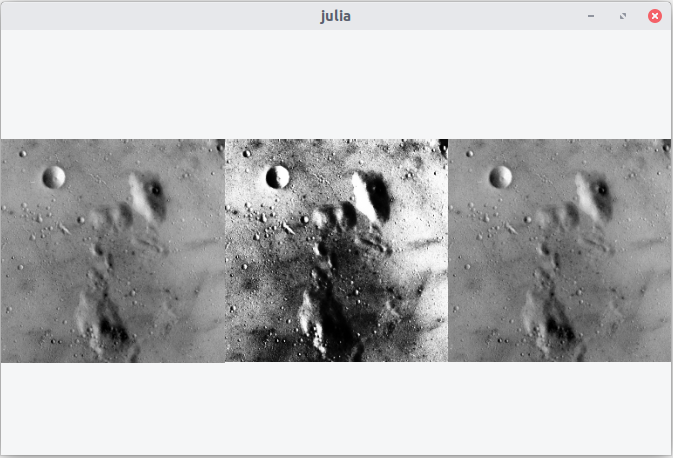

# [Histogram Equalization](@id histogram_equalization)

This illustration enhances an image with low contrast, using
a method called histogram equalization. Observe that image (2)
has roughly linear cumulative distribution function.

Histogram equalisation was initially conceived to  improve the contrast in a
single-channel grayscale image. The method transforms the
distribution of the intensities in an image so that they are as uniform as
possible [1]. The natural justification for uniformity
is that the image has better contrast  if the intensity levels of an image span
a wide range on the intensity scale. As it turns out, the necessary
transformation is a mapping based on the cumulative histogram.

```julia
using Images, ImageView, Colors, TestImages, Gtk.ShortNames

img = testimage("moonsurface")
imgeq = histeq(img, 256)
imgadap = clahe(img, 256)

grid, frames, canvases = canvasgrid((1, 3)) 

imshow(canvases[1,1], img)
imshow(canvases[1,2], imgeq)
imshow(canvases[1,3], imgadap)

win = Window(grid)
Gtk.showall(win)
```
Here's the result in IJulia:


