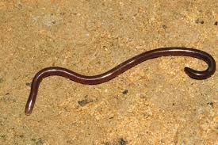
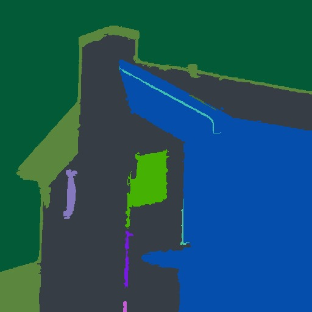

# ImageSegmentation.jl


## Introduction

Image Segmentation is the process of partitioning the image into regions that have similar attributes. Image segmentation has various applications e.g, medical image segmentation, image compression and is used as a preprocessing step in higher level vision tasks like object detection and optical flow. This package is a collection of image segmentation algorithms written in Julia.

## Installation

```julia
Pkg.add("ImageSegmentation")
```

## Functions

All the segmentation algorithms (except Fuzzy C-means) return a struct `SegmentedImage`
that captures most of the details regarding the segments.

* `image_indexmap` - An array conatining the assigned labels for each pixel
* `segment_labels` - List of all the applied labels
* `segment_means` - Dict(Label => Mean intensity)
* `segment_pixel_count` - Dict(Label => Pixel Count)

#### Seeded Region Growing

This algorithm segments an image with repsect to a set of *n* seeds. Given the
set of seeds in the form of a vector of tuples of `CartesianIndex` and label,
the algorithm tries to assign these labels to each of the remaining points.

###### Inputs
* `img`             :  N-D image to be segmented (arbitrary indices are allowed)
* `seeds`           :  `Vector` containing seeds. Each seed is a Tuple of a
                       CartesianIndex{N} and a label. See below note for more
                       information on labels.
* `kernel_dim`      :  (Optional) `Vector{Int}` having length N or a `NTuple{N,Int}`
                       whose ith element is an odd positive integer representing
                       the length of the ith edge of the N-orthotopic neighbourhood
* `neighbourhood`   :  (Optional) Function taking CartesianIndex{N} as input and
                       returning the neighbourhood of that point.
* `diff_fn`         :  (Optional) Function that returns a difference measure(δ)
                       between the mean color of a region and color of a point

!!! note
    The labels attached to points must be positive integers, although multiple
    points can be assigned the same label. The output includes a labelled array
    that has same indexing as that of input image. Every index is assigned to
    either one of labels or a special label '0' indicating that the algorithm
    was unable to assign that index to a unique label.

###### Demo

```julia
julia> using ImageSegmentation, Images;
julia> img = load("worm.jpg");
julia> seeds = [(CartesianIndex(104, 48), 1), (CartesianIndex( 49, 40), 1),
                (CartesianIndex( 72,131), 1), (CartesianIndex(109,217), 1),
                (CartesianIndex( 28, 87), 2), (CartesianIndex( 64,201), 2),
                (CartesianIndex(104, 72), 2), (CartesianIndex( 86,138), 2)];
julia> seg = seeded_region_growing(img, seeds);
```
**Original:**



**Segmented Image with labels replaced by their intensity means:**


#### Unseeded Region Growing


| Threshold | Output | Compression percentage|
| ------------- | ----------| -------------------------|
| Original    |  | 0 % |
| 0.02 |  | 50% |
| 0.05 |  | 62.5% |
| 0.1 |  | 70.8% |
| 0.2 |  | 79.2% |


#### Felzenswalb's Region Merging Algorithm

This algorithm operates on a Region Adjacency Graph (RAG). Each pixel/region is a node in the graph and adjacent pixels/regions have edges between them with weight measuring the dissimilarity between pixels/regions. The algorithm repeatedly merges similar regions till we get the final segmentation. It efficiently computes oversegmented “superpixels” in an image. The function can be directly called with an image (the implementation internally creates a RAG of the image first and then proceeds).

###### Demo

```julia
using Images, ImageSegmentation, TestImages;

img = Gray.(testimage("house"));
segments = felzenszwalb(img, 300, 100);
```

 


Fast Scanning

#### MeanShift Segmentation

MeanShift is a clustering technique. It's primary advantages are that it doesn't assume a prior on the shape of the cluster (e.g, gaussian for k-means) and we also don't need to know the number of clusters beforehand. The algorithm doesn't scale well with size of image.

Region Splitting using RegionTrees

K-means

Fuzzy C-means

#### Watershed

The watershed algorithm treats an image as a topographic surface where bright pixels correspond to peaks and dark pixels correspond to valleys. The algorithm starts flooding from valleys (local minima) of this topographic surface and region boundaries are formed when water from different sources merge. If the image is noisy, this approach leads to oversegmetation. To prevent oversegmentation, marker-based watershed is used i.e. the topographic surface is flooded from a predefined set of markers.  

###### Demo

```julia
using Images, ImageSegmentation;

img = load(download("http://docs.opencv.org/3.1.0/water_coins.jpg"));
bw = Gray.(img).>0.5;
dist = 1.-distance_transform(feature_transform(bw));
markers = label_components(dist.<-15);
segments = watershed(dist, markers);
```

 


