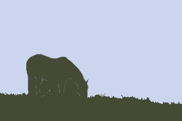
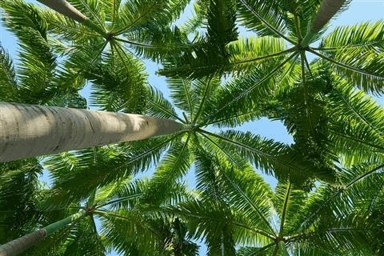
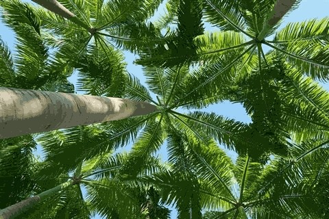
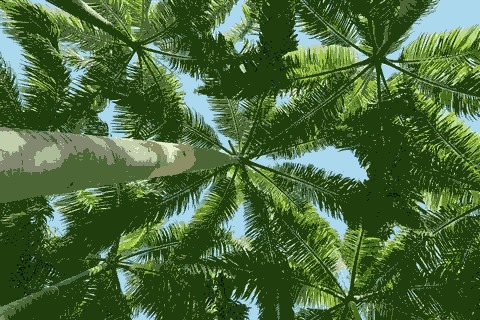
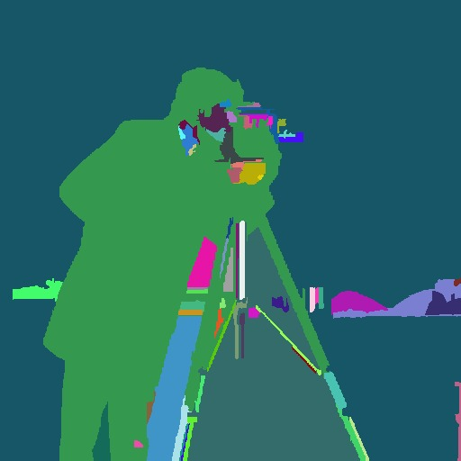
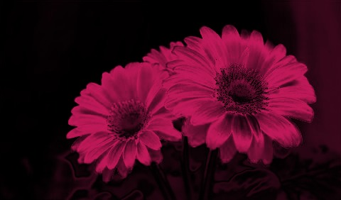
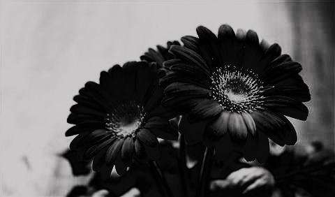

# ImageSegmentation.jl

## Introduction

Image Segmentation is the process of partitioning the image into regions that have similar attributes. Image segmentation has various applications e.g, medical image segmentation, image compression and is used as a preprocessing step in higher level vision tasks like object detection and optical flow. This package is a collection of image segmentation algorithms written in Julia.

## Installation

```julia
Pkg.add("ImageSegmentation")
```

## Example

Image segmentation is not a mathematically well-defined problem: for example, the only lossless representation of the input image would be to say that each pixel is its own segment. Yet this does not correspond to our own intuitive notion that some pixels are naturally grouped together. As a consequence, many algorithms require parameters, often some kind of threshold expressing your willingness to tolerate a certain amount of variation among the pixels within a single segment.

Let's see an example on how to use the segmentation algorithms in this package. We will try to seperate the horse, the ground and the sky in the image below. We will explore two algorithms - seeded region growing and felzenszwalb. Seeded region growing requires us to know the number of segments and some points on each segment beforehand whereas felzenszwalb uses a more abstract parameter controlling degree of within-segment similarity.


[source](https://ibb.co/hUQMnQ)

The documentation for seeded_region_growing says that it needs two arguments - the image to be segmented and a set of seed points for each region. The seed points have to be stored as a vector of (position, label) tuples, where position is a [CartesianIndex](https://docs.julialang.org/en/stable/manual/arrays/#Cartesian-indices-1) and label is an integer. We will start by opening the image using ImageView and reading the coordinates of the seed points.

```julia
using Images, ImageView

img = load("horse.jpg")
imshow(img)
```

Now we can use `seeded_region_growing` with the seed points. For this example, we will use one seed point per segment. We can use more seed points to improve segmentation.

```julia
using ImageSegmentation
seeds = [(CartesianIndex(126,81),1), (CartesianIndex(93,255),2), (CartesianIndex(213,97),3)]
segments = seeded_region_growing(img, seeds)
```

All the segmentation algorithm (except Fuzzy C-means) return a struct `SegmentedImage` that stores the segmentation result. `SegmentedImage` contains a list of applied labels, an array containing the assigned label for each pixel and mean color and number of pixels in each segment.

```julia
length(segments.segment_labels)   # number of segments = 3

segments.segment_means
#first segment's color = RGB(0.926717,0.959906,0.991948) = white
#second segment's color = RGB(0.445402,0.419814,0.278071) = brown
#third segment's color = RGB(0.445402,0.419814,0.278071) = light brown

# for visualizing the segmentation, create an image by replacing each each label in segments.image_indexmap with it's mean color
imshow(map(i->segments.segment_means[i], segments.image_indexmap))
```


Let's segment this image using felzenszwalb algorithm. `felzenswalb` only needs a single parameter k which controls the size of segments. Larger k will result in bigger segments. Using k=5 to k=500 generally gives good results.

```julia
using Images, ImageSegmentation, ImageView

img = load("horse.jpg")
segments = felzenszwalb(img, 100)
imshow(map(i->segments.segment_means[i], segments.image_indexmap))

segments = felzenszwalb(img, 5)  #smaller segments but noisy segmentation
imshow(map(i->segments.segment_means[i], segments.image_indexmap))
```

  

We only got two segments with k = 100. Setting k = 5 resulted in smaller but rather noisy segments. `felzenzwalb` also takes an optional argument `min_size` - it removes all segments smaller with less the `min_size` pixels. Most methods don't remove small segments in their core algorithm. We can use the `prune_segments` method to postprocess the segmentation result and remove small segments.

```julia
segments = felzenszwalb(img, 5, 100)  #removes small segments
imshow(map(i->segments.segment_means[i], segments.image_indexmap))
```


## Algorithms

#### Seeded Region Growing

This algorithm segments an image with repsect to a set of *n* seeds. Given the
set of seeds in the form of a vector of `(position, label)` tuples, where `position`
is a [`CartesianIndex`](https://docs.julialang.org/en/stable/manual/arrays/#Cartesian-indices-1)
and `label` is an integer. The algorithm tries to assign these labels to each of the remaining points.

###### Demo

```julia
julia> using ImageSegmentation, Images;
julia> img = load("worm.jpg");
julia> seeds = [(CartesianIndex(104, 48), 1), (CartesianIndex( 49, 40), 1),
                (CartesianIndex( 72,131), 1), (CartesianIndex(109,217), 1),
                (CartesianIndex( 28, 87), 2), (CartesianIndex( 64,201), 2),
                (CartesianIndex(104, 72), 2), (CartesianIndex( 86,138), 2)];
julia> seg = seeded_region_growing(img, seeds);
```
**Original** [(source)](https://ibb.co/hR2aWk):


**Segmented Image with labels replaced by their intensity means:**


#### Unseeded Region Growing

This algorithm is similar to [Seeded Region Growing](@ref) but does not require
any prior information about the seed points. This algorithm checks all the
boundary points and tries to find the most suitable pixel-label pair. It then
assigns that pixel to the label and updates the boundary points. If no such
pair is found, a new label is assigned to that pixel and the list of labels is updated.

###### Demo

```julia
julia> using ImageSegmentation, Images;
julia> img = load("tree.jpg");
julia> seg = unseeded_region_growing(img, 0.08);
```

| Threshold | Output | Compression percentage|
| ------------- | ----------| -------------------------|
| Original [(source)](http://maxpixel.freegreatpicture.com/static/photo/1x/Plant-Wood-Tissue-Leaves-Nature-Green-Tree-2387626.jpg)  |  | 0 % |
| 0.05 |  | 60.63% |
| 0.1 |  | 71.27% |
| 0.2 |  | 79.96% |


#### Felzenswalb's Region Merging Algorithm

This algorithm operates on a Region Adjacency Graph (RAG). Each pixel/region is a node in the graph and adjacent pixels/regions have edges between them with weight measuring the dissimilarity between pixels/regions. The algorithm repeatedly merges similar regions till we get the final segmentation. It efficiently computes oversegmented “superpixels” in an image. The function can be directly called with an image (the implementation internally creates a RAG of the image first and then proceeds).

###### Demo

```julia
using Images, ImageSegmentation, TestImages;

img = Gray.(testimage("house"));
segments = felzenszwalb(img, 300, 100);
```

 

#### MeanShift Segmentation

MeanShift is a clustering technique. It's primary advantages are that it doesn't assume a prior on the shape of the cluster (e.g, gaussian for k-means) and we also don't need to know the number of clusters beforehand. The algorithm doesn't scale well with size of image.

#### Fast Scanning

Fast scanning algorithm tries to segment the image in two pass by comparing
each pixel to its left-neighbour and noting if it can be merged with them. If it
can't be merged then a new label is assigned to it. If more than one labels can be
assigned then all the applicable labels are merged together. Since it requires only
two passes, it is very fast and can be used in real time applications.

**Time Complexity:** ``O(n)`` where ``n`` is the number of pixels

###### Demo

```julia
julia> using ImageSegmentation, TestImages;
julia> img = testimage("camera");
julia> seg = fast_scanning(img, 0.1);
julia> seg = prune_segments(seg, i->(seg.segment_pixel_count[i]<50), (i,j)->(-seg.segment_pixel_count[j]))
```

**Original:**


**Segmented Image:**



#### Region Splitting using RegionTrees

This algorithm follows the divide and conquer methodology. If the input
image is homogeneous then nothing is to be done. In the other case, the
image is split into two across every dimension and the smaller parts are
segmented recursively. This procedure generates a region tree which can
be used to create a segmented image.

**Time Complexity:** ``O(n*log(n))`` where ``n`` is the number of pixels

###### Demo

```julia
julia> using TestImages, ImageSegmentation;
julia> img = testimage("lena_gray")
julia> function homogeneous(img)
           min, max = extrema(img)
           max - min < 0.2
       end
julia> seg = region_splitting(img, homogeneous);
```

**Original:**


**Segmented Image with labels replaced by their intensity means:**


#### Fuzzy C-means

Fuzzy C-means clustering is widely used for unsupervised image segmentation. It is an
iterative algorithm which tries to minimize the cost function:

```math
J = \displaystyle\sum_{i=1}^{N} \sum_{j=1}^{C} \delta_{ij} \| x_{i} - c_{j} \|^2
```

Unlike K-means, it allows pixels to belong to two or more clusters. It is widely used
for medical imaging like in the soft segmentation of brain tissue model.

**Time Complexity:** ``O(n*C^2*iter)`` where ``n`` is the number of pixels, ``C`` is
number of clusters and ``iter`` is the number of iterations.

###### Demo

```julia
julia> using ImageSegmentation, Images;
julia> img = load("flower.jpg");
julia> r = fuzzy_cmeans(img, 3, 2);
```

**Original** [(source)](https://upload.wikimedia.org/wikipedia/commons/thumb/d/d9/Flower-631765_960_720.jpg/800px-Flower-631765_960_720.jpg)


**Output with pixel intensity = cluster center intensity * membership of pixel in that class**

 


#### Watershed

The watershed algorithm treats an image as a topographic surface where bright pixels correspond to peaks and dark pixels correspond to valleys. The algorithm starts flooding from valleys (local minima) of this topographic surface and region boundaries are formed when water from different sources merge. If the image is noisy, this approach leads to oversegmetation. To prevent oversegmentation, marker-based watershed is used i.e. the topographic surface is flooded from a predefined set of markers.  

###### Demo

```julia
using Images, ImageSegmentation;

img = load(download("http://docs.opencv.org/3.1.0/water_coins.jpg"));
bw = Gray.(img).>0.5;
dist = 1.-distance_transform(feature_transform(bw));
markers = label_components(dist.<-15);
segments = watershed(dist, markers);
```

 

## Some helpful functions

#### Creating a Region Adjacency Graph (RAG)

A region adjacency graph can directly be constructed from a `SegmentedImage`
using the `region_adjacency_graph` function. Each segment is denoted by a vertex
and edges are constructed between adjacent segments. The output is a tuple of
`SimpleWeightedGraph` and a Dict(label=>vertex) with weights assigned according to `weight_fn`.

```julia
julia> using ImageSegmentation, Distances
julia> weight_fn(i,j) = euclidean(seg.segment_pixel_count[i], seg.segment_pixel_count[j]);
julia> G, vert_map = region_adjacency_graph(seg, weight_fn);    # `seg` is a `SegmentedImage`
julia> G
{2536, 6536} undirected simple Int64 graph with Float64 weights
```

#### Creating a Region Tree

A region tree can be constructed from an image using `region_tree` function.
If the image is not homogeneous, then it is split into half along each dimension and
the function is called recursively for each portion of the image. The output is a
`RegionTree`.

```julia
julia> using ImageSegmentation
julia> function homogeneous(img)
           min, max = extrema(img)
           max - min < 0.2
       end
julia> t = region_tree(img, homogeneous)        # `img` is an image
Cell: RegionTrees.HyperRectangle{2,Float64}([1.0, 1.0], [300.0, 300.0])
```

#### Pruning unnecessary segments

All the unnecessary segments can be easily removed from a `SegmentedImage` using
`prune_segments`. It removes a segment by replacing it with the neighbor which has
the least value of `diff_fn`. A list of the segments to be removed can be supplied.
Alternately, a function can be supplied that return true for the labels that must
be removed.

!!! note
    The resultant `SegmentedImage` might have the different labels compared to
    the original `SegmentedImage`.

```julia
julia> seg.image_indexmap
4×4 Array{Int64,2}:
 1  1  3  3
 1  1  3  3
 2  2  2  2
 2  2  2  2
julia> diff_fn(rem_label, neigh_label) = seg.segment_pixel_count[rem_label] - seg.segment_pixel_count[neigh_label];
julia> new_seg = prune_segments(seg, [3], diff_fn);
julia> new_seg.image_indexmap
4×4 Array{Int64,2}:
 1  1  2  2
 1  1  2  2
 2  2  2  2
 2  2  2  2
```

#### Removing a segment

If only one segment is to be removed, then `rem_segment!` can be used.
It removes a segment from a `SegmentedImage` in place, replacing it with the
neighbouring segment having least `diff_fn` value.

!!! note
    If multiple segments need to be removed then [`prune_segments`](@ref) should be
    preferred as it is much more time efficient than calling `rem_segment!` multiple times.

```julia
julia> seg.image_indexmap
4×4 Array{Int64,2}:
 1  1  3  3
 1  1  3  3
 2  2  2  2
 2  2  2  2
julia> diff_fn(rem_label, neigh_label) = seg.segment_pixel_count[rem_label] - seg.segment_pixel_count[neigh_label];
julia> rem_segment!(seg, 3, diff_fn);
julia> seg.image_indexmap
4×4 Array{Int64,2}:
 1  1  2  2
 1  1  2  2
 2  2  2  2
 2  2  2  2
```
