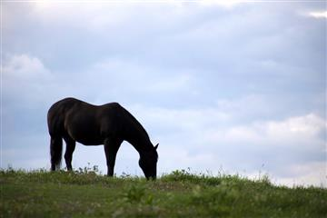
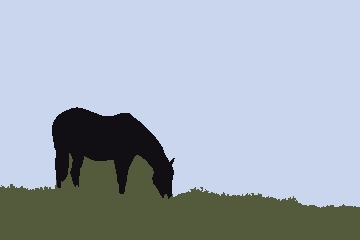
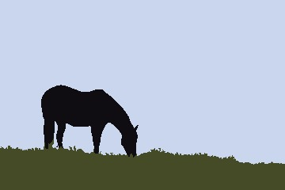
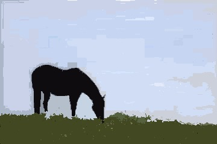
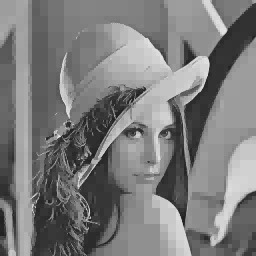
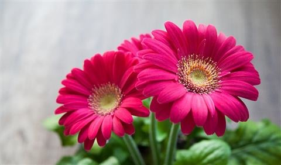
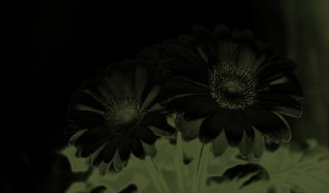
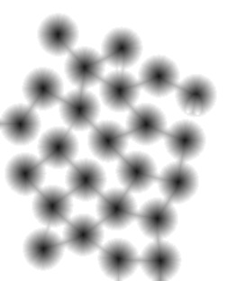
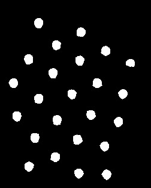
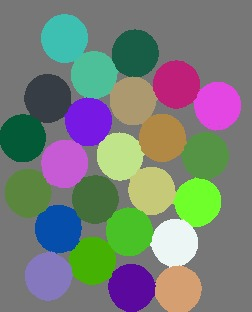

# ImageSegmentation.jl

## Introduction

Image Segmentation is the process of partitioning the image into regions that have similar attributes. Image segmentation has various applications e.g, medical image segmentation, image compression and is used as a preprocessing step in higher level vision tasks like object detection and optical flow. This package is a collection of image segmentation algorithms written in Julia.

## Installation

```julia
(v1.0) pkg> add ImageSegmentation
```

## Example

Image segmentation is not a mathematically well-defined problem: for example, the only lossless representation of the input image would be to say that each pixel is its own segment. Yet this does not correspond to our own intuitive notion that some pixels are naturally grouped together. As a consequence, many algorithms require parameters, often some kind of threshold expressing your willingness to tolerate a certain amount of variation among the pixels within a single segment.

Let's see an example on how to use the segmentation algorithms in this package. We will try to separate the horse, the ground and the sky in the image below. We will explore two algorithms - seeded region growing and felzenszwalb. Seeded region growing requires us to know the number of segments and some points on each segment beforehand whereas felzenszwalb uses a more abstract parameter controlling degree of within-segment similarity.



[source](https://ibb.co/hUQMnQ)

The documentation for `seeded_region_growing` says that it needs two arguments - the image to be segmented and a set of seed points for each region. The seed points have to be stored as a vector of `(position, label)` tuples, where `position` is a [`CartesianIndex`](https://docs.julialang.org/en/stable/manual/arrays/#Cartesian-indices-1) and `label` is an integer. We will start by opening the image using ImageView and reading the coordinates of the seed points.

```julia
using Images, ImageView

img = load("src/assets/segmentation/horse.jpg")
imshow(img)
```

Hover over the different objects you'd like to segment, and read out the coordinates of one or more points inside each object. We will store the seed points as a vector of `(seed position, label)` tuples and use `seeded_region_growing` with the recorded seed points.

```jldoctest; setup = :(using Images; img = load("src/assets/segmentation/horse.jpg")), filter = r"\\s"
using ImageSegmentation
seeds = [(CartesianIndex(126,81),1), (CartesianIndex(93,255),2), (CartesianIndex(213,97),3)]
segments = seeded_region_growing(img, seeds)

# output

Segmented Image with:
  labels map: 240×360 Array{Int64,2}
  number of labels: 3
```

All the segmentation algorithms (except Fuzzy C-means) return a struct `SegmentedImage` that stores the segmentation result.
`SegmentedImage` contains a list of applied labels, an array containing the assigned label for each pixel, and mean color and number of pixels in each segment.
[This section](#Result-1) explains how to access information about the segments.

```@meta
DocTestSetup = quote
    using Images, ImageSegmentation
    img = load("src/assets/segmentation/horse.jpg")
    seeds = [(CartesianIndex(126,81),1), (CartesianIndex(93,255),2), (CartesianIndex(213,97),3)]
    segments = seeded_region_growing(img, seeds)
end
```

```jldoctest
julia> length(segment_labels(segments))
3

julia> segment_mean(segments)
Dict{Int64,RGB{Float64}} with 3 entries:
  2 => RGB{Float64}(0.793679,0.839473,0.932494)
  3 => RGB{Float64}(0.329867,0.357842,0.237361)
  1 => RGB{Float64}(0.0650002,0.0586348,0.074091)
```

We can visualize each segment using its mean color:

```julia
julia> imshow(map(i->segment_mean(segments,i), labels_map(segments)));
```



This display form is used for many of the demonstrations below.

You can see that the algorithm did a fairly good job of segmenting the three objects. The only obvious error is the fact that elements of the sky that were "framed" by the horse ended up being grouped with the ground. This is because `seeded_region_growing` always returns connected regions, and there is no path connecting those portions of sky to the larger image. If we add some additional seed points in those regions, and give them the same label `2` that we used for the rest of the sky, we will get a result that is more or less perfect.

```julia
seeds = [(CartesianIndex(126,81), 1), (CartesianIndex(93,255), 2), (CartesianIndex(171,103), 2),
         (CartesianIndex(172,142), 2), (CartesianIndex(182,72), 2), (CartesianIndex(213,97), 3)]
segments = seeded_region_growing(img, seeds)
```



```@meta
DocTestSetup = nothing
```

Now let's segment this image using felzenszwalb algorithm. `felzenswalb` only needs a single parameter `k` which controls the size of segments. Larger `k` will result in bigger segments. Using `k=5` to `k=500` generally gives good results.

```jldoctest
julia> using Images, ImageSegmentation

julia> img = load("src/assets/segmentation/horse.jpg");

julia> segments = felzenszwalb(img, 100)
Segmented Image with:
  labels map: 240×360 Array{Int64,2}
  number of labels: 43

julia> segments = felzenszwalb(img, 10)  #smaller segments but noisy segmentation
Segmented Image with:
  labels map: 240×360 Array{Int64,2}
  number of labels: 275
```

| k = 100 | k = 10 |
|:------:|:---:|
|  |  |

We only got two "major" segments with `k = 100`. Setting `k = 10` resulted in smaller but rather noisy segments. `felzenzwalb` also takes an optional argument `min_size` - it removes all segments smaller than `min_size` pixels. (Most methods don't remove small segments in their core algorithm. We can use the `prune_segments` method to postprocess the segmentation result and remove small segments.)

```julia
segments = felzenszwalb(img, 10, 100)  # removes segments with fewer than 100 pixels
imshow(map(i->segment_mean(segments,i), labels_map(segments)))
```


## Result

All segmentation algorithms (except Fuzzy C-Means) return a struct [`SegmentedImage`](@ref) as its
output. `SegmentedImage` contains all the necessary information about the segments. The following
functions can be used to get the information about the segments:

1) [`labels_map`](@ref) : It returns an array containing the labels assigned to each pixel
2) [`segment_labels`](@ref) : It returns a list of all the assigned labels
3) [`segment_mean`](@ref) : It returns the mean intensity of the supplied label.
4) [`segment_pixel_count`](@ref) : It returns the count of the pixels that are assigned the supplied label.

###### Demo

```jldoctest; setup = :(using ImageSegmentation)
julia> img = fill(1, 4, 4);

julia> img[1:2,1:2] .= 2;

julia> img
4×4 Array{Int64,2}:
 2  2  1  1
 2  2  1  1
 1  1  1  1
 1  1  1  1

julia> seg = fast_scanning(img, 0.5);

julia> labels_map(seg) # returns the assigned labels map
4×4 Array{Int64,2}:
 1  1  3  3
 1  1  3  3
 3  3  3  3
 3  3  3  3

julia> segment_labels(seg) # returns a list of all assigned labels
2-element Array{Int64,1}:
 1
 3

julia> segment_mean(seg, 1) # returns the mean intensity of label 1
2.0

julia> segment_pixel_count(seg, 1) # returns the pixel count of label 1
4
```

## Algorithms

#### Seeded Region Growing

Seeded region growing segments an image with respect to some user-defined seeds.
Each seed is a `(position, label)` tuple, where `position` is a
[`CartesianIndex`](https://docs.julialang.org/en/stable/manual/arrays/#Cartesian-indices-1) and
`label` is a positive integer. Each label corresponds to a unique partition of the image.
The algorithm tries to assign these labels to each of the remaining points.
If more than one point has the same label then they will be contribute to the same segment.

###### Demo

```jldoctest
julia> using Images, ImageSegmentation

julia> img = load("src/assets/segmentation/worm.jpg");

julia> seeds = [(CartesianIndex(104, 48), 1), (CartesianIndex( 49, 40), 1),
                (CartesianIndex( 72,131), 1), (CartesianIndex(109,217), 1),
                (CartesianIndex( 28, 87), 2), (CartesianIndex( 64,201), 2),
                (CartesianIndex(104, 72), 2), (CartesianIndex( 86,138), 2)];

julia> seg = seeded_region_growing(img, seeds)
Segmented Image with:
  labels map: 183×275 Array{Int64,2}
  number of labels: 2
```
**Original** [(source)](https://upload.wikimedia.org/wikipedia/commons/thumb/6/6d/Davidraju_Worm_Snake.jpg/275px-Davidraju_Worm_Snake.jpg):


**Segmented Image with labels replaced by their intensity means:**


#### Unseeded Region Growing

This algorithm is similar to [Seeded Region Growing](@ref) but does not require
any prior information about the seed points. The segmentation process initializes
with region ``A_1`` containing a single pixel of the image. Let an intermediate state
of the algorithm consist of a set of identified regions ``A_1, A_2, ..., A_n``.
Let ``T`` be the set of all unallocated pixels which borders at least one of these
regions. The growing process involves selecting a point ``z \in T`` and region ``A_j``
where ``j \in [ \, 1,n ] \,`` such that

```math
\delta ( \, z, A_j ) \, = min_{x \in T, k \in [ \, 1,n ] \, } \{ \delta ( \, x, A_k ) \, \}
```
where `` \delta ( \, x, A_i ) \, = | img ( \, x ) \, - mean_{y \in A_i} [ \, img ( \, y ) \, ] \, |``

If ``\delta ( \, z, A_j ) \,`` is less than `threshold` then the pixel `z` is added to ``A_j``.
Otherwise we choose the most similar region ``\alpha`` such that

```math
\alpha = argmin_{A_k} \{ \delta ( \, z, A_k) \, \}
```
If ``\delta ( \, z, \alpha ) \,`` is less than `threshold` then the pixel `z` is added to ``\alpha``.
If neither of the two conditions is satisfied, then the pixel is assigned a new region ``A_{n+1}``.
After assignment of ``z``, we update the statistic of the assigned region. The algorithm halts when
all the pixels have been assigned to some region.

`unseeded_region_growing` requires the image `img` and `threshold` as its parameters.

###### Demo

```jldoctest
julia> using ImageSegmentation, Images

julia> img = load("src/assets/segmentation/tree.jpg");

julia> seg = unseeded_region_growing(img, 0.05) # here 0.05 is the threshold
Segmented Image with:
  labels map: 320×480 Array{Int64,2}
  number of labels: 774
```

| Threshold | Output | Compression percentage|
| ------------- | ----------| -------------------------|
| Original [(source)](http://maxpixel.freegreatpicture.com/static/photo/1x/Plant-Wood-Tissue-Leaves-Nature-Green-Tree-2387626.jpg)  |  | 0 % |
| 0.05 |  | 60.63% |
| 0.1 |  | 71.27% |
| 0.2 |  | 79.96% |


#### Felzenswalb's Region Merging Algorithm

This algorithm operates on a Region Adjacency Graph (RAG). Each pixel/region is a node in the graph and adjacent pixels/regions have edges between them with weight measuring the dissimilarity between pixels/regions. The algorithm repeatedly merges similar regions till we get the final segmentation. It efficiently computes oversegmented “superpixels” in an image. The function can be directly called with an image (the implementation internally creates a RAG of the image first and then proceeds).

###### Demo

```jldoctest
julia> using Images, ImageSegmentation, TestImages

julia> img = Gray.(testimage("house"));

julia> segments = felzenszwalb(img, 300, 100) # k=300 (the merging threshold), min_size = 100 (smallest number of pixels/region)
Segmented Image with:
  labels map: 512×512 Array{Int64,2}
  number of labels: 11
```

Here let's visualize segmentation by creating an image with each label replaced by a random color:
```julia
function get_random_color(ind)
    N = 3
    ϕ =  1.2207440846057596
    acoeff = ϕ.^(-(1:N))
    a, b, c = ntuple(N) do i
       ceil(Int, ((acoeff[i]*ind) % 1)*256)/256
    end
    RGB{N0f8}(a, c, b)
end
imshow(map(i->get_random_color(i), labels_map(segments)))
```

 

#### MeanShift Segmentation

MeanShift is a clustering technique. Its primary advantages are that it doesn't assume a prior on the shape of the cluster (e.g, gaussian for k-means) and we don't need to know the number of clusters beforehand. The algorithm doesn't scale well with size of image.

###### Demo

```jldoctest
julia> using Images, ImageSegmentation, TestImages

julia> img = Gray.(testimage("house"));

julia> img = imresize(img, (128, 128));

julia> segments = meanshift(img, 16, 8/255) # parameters are smoothing radii: spatial=16, intensity-wise=8/255
Segmented Image with:
  labels map: 128×128 Array{Int64,2}
  number of labels: 42
```
 

#### Fast Scanning

Fast scanning algorithm segments the image by scanning it once and comparing each
pixel to its upper and left neighbor. The algorithm starts from the first pixel
and assigns it to a new segment ``A_1``. Label count `lc` is assigned 1. Then it starts a column-wise traversal
of the image and for every pixel, it computes the difference measure `diff_fn`
between the pixel and its left neighbor, say ``\delta_{l}`` and between the pixel and
its top neighbor, say ``\delta_{t}``. Four cases arise:
1) ``\delta_{l}`` >= `threshold` and ``\delta_{t}`` < `threshold` : We can say that the point has similar intensity to that its top neighbor. Hence, we assign the point to the segment that contains its top neighbor.
2) ``\delta_{l}`` < `threshold` and ``\delta_{t}`` >= `threshold` : Similar to case 1, we assign the point to the segment that contains its left neighbor.
3) ``\delta_{l}`` >= `threshold` and ``\delta_{t}`` >= `threshold` : Point is significantly different from its top and left neighbors and is assigned a new label ``A_{lc+1}`` and `lc` is incremented.
4) ``\delta_{l}`` < `threshold` and ``\delta_{t}`` < `threshold` : In this case, we merge the top and left semgents together and assign the point under consideration to this merged segment.

This algorithm segments the image in just two passes (one for segmenting and other for
merging), hence it is very fast and can be used in real time applications.

**Time Complexity:** ``O(n)`` where ``n`` is the number of pixels

###### Demo

```jldoctest
julia> using ImageSegmentation, TestImages

julia> img = testimage("camera");

julia> seg = fast_scanning(img, 0.1)  # threshold = 0.1
Segmented Image with:
  labels map: 512×512 Array{Int64,2}
  number of labels: 2536

julia> seg = prune_segments(seg, i->(segment_pixel_count(seg,i)<50), (i,j)->(-segment_pixel_count(seg,j)))
Segmented Image with:
  labels map: 512×512 Array{Int64,2}
  number of labels: 65
```

**Original:**


**Segmented Image:**


#### Region Splitting using RegionTrees

This algorithm follows the divide and conquer methodology. If the input
image is homogeneous then nothing is to be done. In the other case, the
image is split into two across every dimension and the smaller parts are
segmented recursively. This procedure generates a region tree which can
be used to create a segmented image.

**Time Complexity:** ``O(n*log(n))`` where ``n`` is the number of pixels

###### Demo

```jldoctest
julia> using TestImages, ImageSegmentation

julia> img = testimage("lena_gray");

julia> function homogeneous(img)
           min, max = extrema(img)
           max - min < 0.2
       end
homogeneous (generic function with 1 method)

julia> seg = region_splitting(img, homogeneous)
Segmented Image with:
  labels map: 256×256 Array{Int64,2}
  number of labels: 8836
```

**Original:**


**Segmented Image with labels replaced by their intensity means:**



#### Fuzzy C-means

Fuzzy C-means clustering is widely used for unsupervised image segmentation. It is an
iterative algorithm which tries to minimize the cost function:

```math
J = \displaystyle\sum_{i=1}^{N} \sum_{j=1}^{C} \delta_{ij} \| x_{i} - c_{j} \|^2
```

Unlike K-means, it allows pixels to belong to two or more clusters. It is widely used
for medical imaging like in the soft segmentation of brain tissue model.
Note that both Fuzzy C-means and K-means have an element of randomness, and it's possible
to get results that vary considerably from one run to the next.

**Time Complexity:** ``O(n*C^2*iter)`` where ``n`` is the number of pixels, ``C`` is
number of clusters and ``iter`` is the number of iterations.

###### Demo

```jldoctest; filter=r"converged in [0-9]+ iterations"
julia> using ImageSegmentation, Images

julia> img = load("src/assets/segmentation/flower.jpg");

julia> r = fuzzy_cmeans(img, 3, 2)
FuzzyCMeansResult: 3 clusters for 135360 points in 3 dimensions (converged in 27 iterations)
```

Briefly, `r` contains two fields of interest:

- `centers`, a `3×C` matrix of center positions for `C` clusters in RGB colorspace. You can extract it as a vector of colors using `centers = colorview(RGB, r.centers)`.
- `weights`, a `n×C` matrix such that `r.weights[10,2]` would be the weight of the 10th pixel in the green color channel (color channel 2).  You can visualize this component as `centers[i]*reshape(r.weights[:,i], axes(img))`.

See the documentation in [Clustering.jl](https://github.com/JuliaStats/Clustering.jl) for further details.

**Original** [(source)](https://upload.wikimedia.org/wikipedia/commons/thumb/d/d9/Flower-631765_960_720.jpg/800px-Flower-631765_960_720.jpg)




**Output with pixel intensity = cluster center intensity * membership of pixel in that class**

| Magenta petals | Greenish Leaves | White background |
|----------------|-----------------|------------------|
|  | |  |

#### Watershed

The watershed algorithm treats an image as a topographic surface where bright pixels correspond to peaks and dark pixels correspond to valleys. The algorithm starts flooding from valleys (local minima) of this topographic surface and region boundaries are formed when water from different sources merge. If the image is noisy, this approach leads to oversegmetation. To prevent oversegmentation, marker-based watershed is used i.e. the topographic surface is flooded from a predefined set of markers.

Let's see an example on how to use watershed to segment touching objects. To use watershed, we need to modify the image such that in the new image flooding the topographic surface from the markers separates each coin. If this modified image is noisy, flooding from local minima may lead to oversegmentation and so we also need a way to find the marker positions. In this example, the inverted [`distance_transform`](@ref) of the thresholded image (`dist` image) has the required topographic structure ([This page](https://in.mathworks.com/company/newsletters/articles/the-watershed-transform-strategies-for-image-segmentation.html) explains why this works). We can threshold the `dist` image to get the marker positions.

###### Demo

```julia-repl
julia> using Images, ImageSegmentation

julia> img = load(download("http://docs.opencv.org/3.1.0/water_coins.jpg"));

julia> bw = Gray.(img) .> 0.5;

julia> dist = 1 .- distance_transform(feature_transform(bw));

julia> markers = label_components(dist .< -15);

julia> segments = watershed(dist, markers)
Segmented Image with:
  labels map: 312×252 Array{Int64,2}
  number of labels: 24

julia> imshow(map(i->get_random_color(i), labels_map(segments)) .* (1 .-bw))       #shows segmented image
```

| Original Image | Thresholded Image |
|:------:|:---:|
|  |  |

| Inverted Distance Transform Image | Markers |
|:------:|:---:|
|  | |

| Segmented Image |
|:------:|
|  |


## Some helpful functions

#### Creating a Region Adjacency Graph (RAG)

A region adjacency graph can directly be constructed from a `SegmentedImage`
using the `region_adjacency_graph` function. Each segment is denoted by a vertex
and edges are constructed between adjacent segments. The output is a tuple of
`SimpleWeightedGraph` and a `Dict(label=>vertex)` with weights assigned according to `weight_fn`.

```jldoctest
julia> using ImageSegmentation, Distances, TestImages

julia> img = testimage("camera");

julia> seg = felzenszwalb(img, 10, 100);

julia> weight_fn(i,j) = euclidean(segment_pixel_count(seg,i), segment_pixel_count(seg,j));

julia> G, vert_map = region_adjacency_graph(seg, weight_fn);

julia> G
{70, 139} undirected simple Int64 graph with Float64 weights
```

Here, the difference in pixel count has been used as the weight of the connecting edges.
This difference measure can be useful if one wants to use this region adjacency graph to
remove smaller segments by merging them with their neighbouring largest segment.
Another useful difference measure is the euclidean distance between the mean intensities
of the two segments.

#### Creating a Region Tree

A region tree can be constructed from an image using `region_tree` function.
If the image is not homogeneous, then it is split into half along each dimension and
the function is called recursively for each portion of the image. The output is a
`RegionTree`.

```jldoctest; setup = :(img = ones(300, 300))
julia> using ImageSegmentation

julia> function homogeneous(img)
           min, max = extrema(img)
           max - min < 0.2
       end
homogeneous (generic function with 1 method)

julia> t = region_tree(img, homogeneous)        # `img` is an image
Cell: RegionTrees.HyperRectangle{2,Float64}([1.0, 1.0], [300.0, 300.0])
```

For more information regarding `RegionTrees`, see [this](https://github.com/rdeits/RegionTrees.jl#regiontreesjl-quadtrees-octrees-and-their-n-dimensional-cousins).

#### Pruning unnecessary segments

All the unnecessary segments can be easily removed from a `SegmentedImage` using
`prune_segments`. It removes a segment by replacing it with the neighbor which has
the least value of `diff_fn`. A list of the segments to be removed can be supplied.
Alternately, a function can be supplied that returns `true` for the labels that must
be removed.

!!! note
    The resultant `SegmentedImage` might have the different labels compared to
    the original `SegmentedImage`.

For this example and the next one (in [Removing a segment](@ref)), a sample
`SegmentedImage` has been used. It can be generated as:

```jldoctest prune; setup = :(using ImageSegmentation)
julia> img = fill(1, (4, 4));

julia> img[3:4,:] .= 2;

julia> img[1:2,3:4] .= 3;

julia> seg = fast_scanning(img, 0.5);

julia> labels_map(seg)
4×4 Array{Int64,2}:
 1  1  3  3
 1  1  3  3
 2  2  2  2
 2  2  2  2

julia> seg.image_indexmap
4×4 Array{Int64,2}:
 1  1  3  3
 1  1  3  3
 2  2  2  2
 2  2  2  2

julia> diff_fn(rem_label, neigh_label) = segment_pixel_count(seg,rem_label) - segment_pixel_count(seg,neigh_label);

julia> new_seg = prune_segments(seg, [3], diff_fn);

julia> labels_map(new_seg)
4×4 Array{Int64,2}:
 1  1  2  2
 1  1  2  2
 2  2  2  2
 2  2  2  2
```

#### Removing a segment

If only one segment is to be removed, then `rem_segment!` can be used.
It removes a segment from a `SegmentedImage` in place, replacing it with the
neighbouring segment having least `diff_fn` value.

!!! note
    If multiple segments need to be removed then [`prune_segments`](@ref) should be
    preferred as it is much more time efficient than calling `rem_segment!` multiple times.

```jldoctest prune
julia> seg.image_indexmap
4×4 Array{Int64,2}:
 1  1  3  3
 1  1  3  3
 2  2  2  2
 2  2  2  2

julia> diff_fn(rem_label, neigh_label) = segment_pixel_count(seg,rem_label) - segment_pixel_count(seg,neigh_label);

julia> rem_segment!(seg, 3, diff_fn);

julia> labels_map(new_seg)
4×4 Array{Int64,2}:
 1  1  2  2
 1  1  2  2
 2  2  2  2
 2  2  2  2
```
