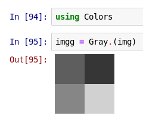
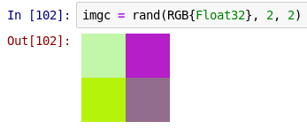
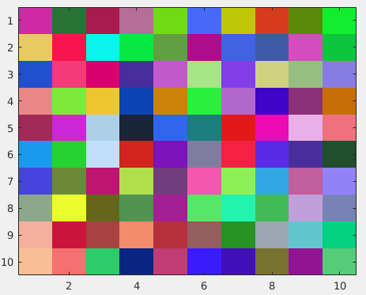
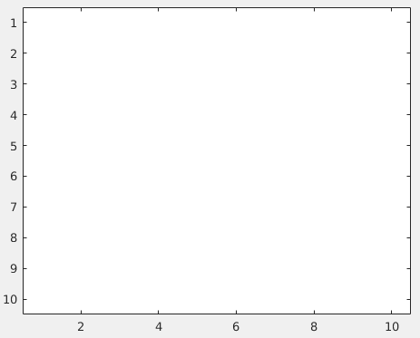
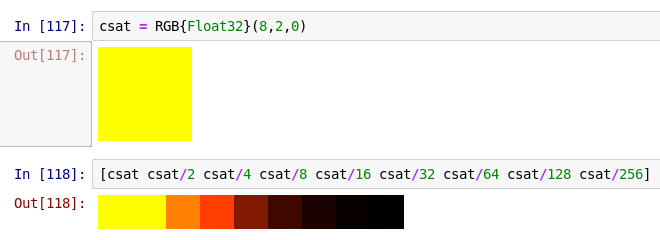

# [Arrays, Numbers, and Colors](@id page_arrays_colors)

```@meta
DocTestSetup = quote
    using Random
    Random.seed!(2)
end
```

In Julia, an image is just an array, and many of the ways you
manipulate images come from the general methods to work with
[multidimensional arrays](https://docs.julialang.org/en/v1/manual/arrays/). For
example,


```jldoctest
julia> img = rand(2,2)
2×2 Matrix{Float64}:
 0.366796  0.210256
 0.523879  0.819338
```

defines an "image" `img` of 64-bit floating-point numbers. You should
be able to use this as an image in most or all functions in
JuliaImages.

We'll be talking quite a bit about handling arrays. This page will
focus on the "element type" (`eltype`) stored in the array. In case
you're new to Julia, if `a` is an array of integers:

```jldoctest
julia> a = [1,2,3,4]
4-element Vector{Int64}:
 1
 2
 3
 4
```

then either of the following creates a new array where the element type is `Float64`:

```julia
map(Float64, a)
Float64.(a)     # short for broadcast(Float64, a)
```

For example,

```julia
julia> Float64.(a)
4-element Vector{Float64}:
 1.0
 2.0
 3.0
 4.0
```

Arrays are indexed with square brackets (`a[1]`), with indexing
starting at 1 by default. A two-dimensional array like `img` can be
indexed as `img[2,1]`, which would be the second row, first
column. Julia also supports "linear indexing," using a single integer
to address elements of an arbitrary multidimensional array in a manner
that (in simple cases) reflects the memory offset of the particular
element. For example, `img[3]` corresponds to `img[1,2]` (numbering
goes down columns, and then wraps around at the top of the next
column, because Julia arrays are stored in "column major" order where
the fastest dimension is the first dimension).

## Numbers versus colors

For the array `img` we created above, you can display it as a
grayscale image using ImageView. But if you happen to be following along in
Juno or IJulia, you might notice that `img` does not *display* as an image:
instead, it prints as an array of numbers as shown above.  Arrays of
"plain numbers" are not displayed graphically, because they might
represent something numerical (e.g., a matrix used for linear algebra)
rather than an image. To indicate that this is worthy of graphical
display, convert the element type to a color chosen from the
[Colors](https://github.com/JuliaGraphics/Colors.jl) package:



Here we used `Gray` to indicate that this array should be interpreted
as a grayscale image.
(Note that the Images package re-exports Colors, so you can alternatively
say `using Images`.)

Under the hood, what is `Gray` doing?  It's informative to see the
"raw" object, displayed as text:


(Users of Juno or the Julia command-line REPL interface will see this
representation immediately.)

You can see this is a 2×2 array of `Gray{Float64}` objects. You might
be curious how these `Gray` objects are represented. In the
command-line REPL, it looks like this (the same command works with
IJulia):

```julia
julia> dump(imgg[1,1])
ColorTypes.Gray{Float64}
  val: Float64 0.36679641243992434
```

`dump` shows the "internal" representation of an object.  You can see
that `Gray` is a
[type](https://docs.julialang.org/en/v1/manual/types/)
(technically, an immutable `struct`) with a single field `val`; for
`Gray{Float64}`, `val` is a 64-bit floating point number. Using `val`
directly is not recommended: you can extract the `Float64` value with
the accessor functions `real` or `gray` (the reason for the latter
name will be clearer when we discuss RGB colors).

What kind of overhead do these objects incur?

```julia
julia> sizeof(img)
32

julia> sizeof(imgg)
32
```

The answer is "none": they don't take up any memory of their own, nor
do they typically require any additional processing time. The `Gray`
"wrapper" is just an *interpretation* of the values, one that helps
clarify that this should be displayed as a grayscale image.  Indeed,
`img` and `imgg` compare as equal:

```julia
julia> img == imgg
true
```

There's more to say on this topic, but we'll wait until we discuss [Conversions vs. views](@ref page_conversions_views).

## Colors beyond the pale

`Gray` is not the only color in the universe:



Let's look at `imgc` as text (shown here in the REPL):

```julia
julia> imgc
2×2 Array{ColorTypes.RGB{Float32},2}:
 RGB{Float32}(0.75509,0.965058,0.65486)     RGB{Float32}(0.696203,0.142474,0.783316)
 RGB{Float32}(0.705195,0.953892,0.0744661)  RGB{Float32}(0.571945,0.42736,0.548254)

julia> size(imgc)
(2,2)

julia> dump(imgc[1,1])
ColorTypes.RGB{Float32}
  r: Float32 0.7550899
  g: Float32 0.9650581
  b: Float32 0.65485954
```

Here we see one of the primary differences between Julia's approach to
images and that of several other popular frameworks: `imgc` does not
have a dimension of the array devoted to the "color channel." Instead,
every element of the array corresponds to a complete pixel's worth of
information. Often this simplifies the logic of many algorithms,
sometimes allowing a single implementation to work for both color and
grayscale images.

You can extract the individual color channels using their field names
(`r`, `g`, and `b`), but as you'll see in a moment, a more universal
approach is to use accessor functions:

```julia
julia> c = imgc[1,1]; (red(c), green(c), blue(c))
(0.7550899f0,0.9650581f0,0.65485954f0)
```

Julia's Colors package allows the same color to be represented in
several different ways, and this can facilitate interaction with other
tools. For example, certain C libraries permit or prefer the order of
the color channels to be different:

```julia
julia> dump(BGR(c))
ColorTypes.BGR{Float32}
  b: Float32 0.65485954
  g: Float32 0.9650581
  r: Float32 0.7550899
```

or even to pack the red, green, and blue colors—together with a
dummy "alpha" (transparency) channel—into a single 32-bit integer:

```julia
julia> c24 = RGB24(c); dump(c24)
ColorTypes.RGB24
  color: UInt32 12711591

julia> c24.color
0x00c1f6a7
```

From first (the first two hex-digits after the "0x") to last (the
final two hex-digits), the order of the channels here is alpha, red,
green, blue:

```julia
julia> 0xc1/0xff
0.7568627450980392

julia> 0xf6/0xff
0.9647058823529412

julia> 0xa7/0xff
0.6549019607843137
```

These values are close to the channels of `c`, but have been rounded
off—each channel is encoded with only 8 bits, so some approximation
of the exact floating-point value is unavoidable.

## [A consistent scale for floating-point and "integer" colors: fixed-point numbers](@id fixedpoint)

`c24` does not have an `r` field, but we can still use `red` to
extract the red channel:

```julia
julia> r = red(c24)
0.757N0f8
```

This may look fairly strange at first, so let's unpack this
carefully. Notice first that the "floating-point" portion of this
number matches (to within the precision of the rounding) the value of
`red(c)`. The `N0f8` means "**N**ormalized with **8 f**ractional bits,
with **0** bits left for representing values higher than 1." This is a
[fixed-point number](https://en.wikipedia.org/wiki/Fixed-point_arithmetic)—rather
like floating-point numbers, except that the decimal does not
"float". Internally, these are represented in terms of the 8-bit
unsigned integer `UInt8`

```julia
julia> dump(r)
FixedPointNumbers.N0f8
  i: UInt8 193
```

(Note that `N0f8` is an abbreviation; the full typename is
`Normed{UInt8, 8}`.) `N0f8` *interprets* this 8-bit integer as a value
lying between 0 and 1, with 0 corresponding to `0x00` and 1
corresponding to `0xff`. This interpretation affects how the number is
used for arithmetic and conversion to and from other values. Stated
another way, `r` behaves as

```julia
julia> r == 193/255
true
```
for essentially all purposes (but see [A note on arithmetic overflow](@ref)).

This has a very important consequence: **in many other image
frameworks, the "meaning" of an image depends on how it is stored, but
in Julia the meaning can be assigned independently of storage
representation.** For example, in a different language/framework, the
following sequence:

```
img = uint8(255*rand(10, 10, 3));
figure; image(img)
imgd = double(img);   % convert to double-precision, but don't change the values
figure; image(imgd)
```

might produce the following images:

| img | imgd |
|:------:|:---:|
|  |  |

The one on the right looks white because floating-point types are
interpreted on a 0-to-1 colorscale (and all of the entries in `img`
happen to be 1 or higher), whereas `uint8` is interpreted on a
0-to-255 colorscale. Unfortunately, two arrays that are *numerically identical*
have very different meanings as images.

Many frameworks offer convenience functions for converting images from
one representation to another, but this can be a source of bugs if we
go to compare images: in most number systems we would agree that `255
!= 1.0`, and this fact means that you sometimes need to be quite
careful when converting from one representation to another.
Conversely, using these Julia packages **there is no discrepancy in
"meaning" between the encoding of images represented as floating point
or 8-bit (or 16-bit) fixed-point numbers: 0 always means "black" and 1 or something
greater than 1 always means "white" or "saturated."**

Now, this doesn't prevent you from constructing pixels with values out
of this range:



Notice that the first two yellows look identical, because both the red
and green color channels are 1 or higher and consequently are
saturated.

However, you should be aware that for *integer* inputs, the default is
to use the `N0f8` element type, and this type cannot represent values
outside the range from 0 to 1:

```@repl
using ColorTypes # hide
RGB(8,2,0)
```

The error message here reminds you how to resolve a common mistake,
trying to construct red as `RGB(255, 0, 0)`. In Julia, that should
always be `RGB(1, 0, 0)`.

## More fixed-point numbers

16-bit images can be expressed in terms of the `N0f16` type. Let's
compare the maximum values (`typemax`) and smallest-difference (`eps`)
representable with `N0f8` and `N0f16`:

```jldoctest
julia> using FixedPointNumbers

julia> (typemax(N0f8), eps(N0f8))
(1.0N0f8, 0.004N0f8)

julia> (typemax(N0f16), eps(N0f16))
(1.0N0f16, 2.0e-5N0f16)
```

You can see that this type also has a maximum value of 1, but is
higher precision, with the gap between adjacent numbers being much
smaller.


Many cameras (particularly, scientific cameras) now return 16-bit
values. However, some cameras do not provide a full 16 bits worth of
information; for example, the camera might be 12-bit and return values
between `0x0000` and `0x0fff`.  As an `N0f16`, the latter displays as
nearly black:


Since the camera is saturated, this is quite misleading—it should
instead display as white.

This again illustrates one of the fundamental problems about assuming
that the *representation* (a 16-bit integer) also describes the
*meaning* of the number. In Julia, we decouple these by providing many
different fixed-point number types. In this case, the natural way to
interpret these values is by using a fixed-point number with 12
fractional bits; this leaves 4 bits that we can use to represent
values bigger than 1, so the number type is called `N4f12`:

```jldoctest; setup = :(using FixedPointNumbers)
julia> (typemax(N4f12), eps(N4f12))
(16.0037N4f12, 0.0002N4f12)
```

You can see that the maximum value achievable by an `N4f12` is
approximately 16 = 2^4.

Using this `N4f12` interpretation of the 16 bits, the color displays
correctly as white:


and acts like 1 for all arithmetic purposes. Even though the raw
representation as `0x0fff` is the same, we can endow the number with
appropriate meaning through its type.

## A note on arithmetic overflow

Sometimes, being able to construct a color values outside 0 to 1 is
useful. For example, if you want to compute the average color in an
image, the natural approach is to first sum all the pixels and then
divide by the total number of pixels. At an intermediate stage, the
sum will typically result in a color that is well beyond saturation.

It's important to note that arithmetic with `N0f8` numbers, like
arithmetic with `UInt8`, overflows:

```jldoctest; setup = :(using FixedPointNumbers)
julia> 0xff + 0xff
0xfe

julia> 1N0f8 + 1N0f8
0.996N0f8

julia> 0xfe/0xff      # the first result corresponds to the second result
0.996078431372549
```

Consequently, if you're accumulating values, it's advisable to
accumulate them in an appropriate floating-point type, such as
`Float32`, `Gray{Float64}`, or `RGB{Float32}`.
