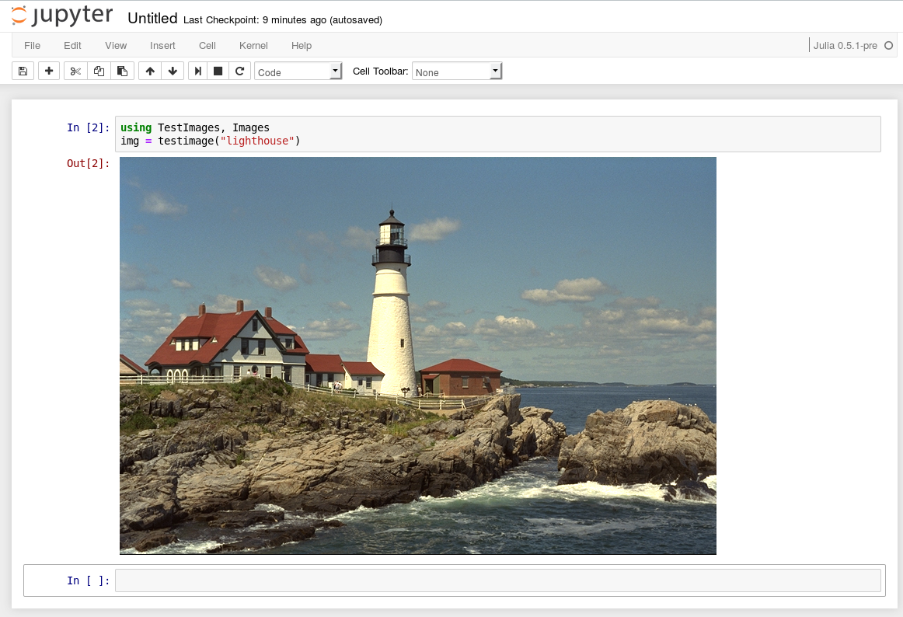

# [Getting started](@id page_get_started)

Most users probably want to start with the `Images.jl` package, which bundles
much (but not all) of the functionality in JuliaImages.

## Installation

Images (and possibly some additional packages) may be all you need to manipulate images programmatically.
You can install `Images.jl` via the [package manager](https://docs.julialang.org/en/v1/stdlib/Pkg/),

```julia
(v1.0) pkg> add Images
```

!!! note
    People in some regions such as China might fail to install/precompile `Images` due to poor network
    status. Using proxy/VPN that has stable connection to Amazon S3 and Github can solve this issue.

## [Loading your first image](@id sec_imageio)

If this is your first time working with images in julia, it's likely that you'll need to install some
image IO backends to load the images. The current available backends for image files are:

* [ImageMagick.jl](https://github.com/JuliaIO/ImageMagick.jl) covers most image formats and has extra
  functionality. This can be your first choice if you don't have a preference.
* [QuartzImageIO.jl](https://github.com/JuliaIO/QuartzImageIO.jl) exposes macOS's native image IO
  functionality to Julia. In some cases it's faster than ImageMagick, but it might not cover all your
  needs.
* [ImageIO.jl](https://github.com/JuliaIO/ImageIO.jl) is a new image IO backend (requires julia >=v"1.3")
  that provides an optimized performance for PNG files. Check benchmark
  [here](https://github.com/JuliaIO/PNGFiles.jl/issues/1)
* [OMETIFF.jl](https://github.com/tlnagy/OMETIFF.jl) supports
  [OME-TIFF](https://docs.openmicroscopy.org/ome-model/6.0.0/index.html#ome-tiff) files. If you don't
  know what it is, then it is likely that you don't need this package.

These backends aren't exclusive to each other, so if you're a macOS user, you can install all these
backends. And in most cases, you don't need to directly interact with these backends, instead, we
use the `save` and `load` provided by the [`FileIO.jl`](https://github.com/JuliaIO/FileIO.jl)
frontend. If you've installed multiple backends then `FileIO` will choose the most appropriate
backend acoording to your file format. For example, if available `ImageIO` is used to load PNG
files.

Adding these gives you a basic image IO setup:

```julia
(v1.0) pkg> add FileIO ImageMagick ImageIO
```

and to load an image, you can use

```@example
using FileIO
using ImageShow # hide
# specify the path to your local image file
img_path = "/path/to/image.png"
img_path = joinpath("assets", "installation", "mandrill.tiff") # hide
img = load(img_path)
```

When testing ideas or just following along with the documentation, it can be useful to have some
images to work with. The [TestImages.jl](https://github.com/JuliaImages/TestImages.jl) package
bundles several "standard" images for you.

```julia
(v1.0) pkg> add TestImages
```

To load one of the images from this package, say

```julia
using TestImages
# backends such as ImageMagick are required
img = testimage("mandrill")
```

## [Displaying images](@id sec_visualization)

When working with images, it's obviously helpful to be able to look at
them.  If you use Julia through [Juno](http://junolab.org/) or
[IJulia](https://github.com/JuliaLang/IJulia.jl), images should
display automatically:



Currently there're five julia packages can be used to display an image:

* [`ImageShow`](https://github.com/JuliaImages/ImageShow.jl) is used to support image display in Juno and IJulia. This happens automatically if you are `using Images`.
* [`ImageInTerminal`](https://github.com/JuliaImages/ImageInTerminal.jl) is used to support image display in terminal.
* [`ImageView`](https://github.com/JuliaImages/ImageView.jl) is an image display GUI. (For OSX and Windows platforms, Julia at least `v1.3` is required)
* [`Plots`](https://github.com/JuliaPlots/Plots.jl) maintained by JuliaPlots is a general plotting package that support image display.
* [`Makie`](https://github.com/JuliaPlots/Makie.jl) is also maintained by JuliaPlots but provides rich interactive functionality. 

To visualize multiple images in one frame, you can create a bigger image from multiple image sources with [`mosaicview`](@ref),
which is an enhanced version of `cat`s.

```@setup mosaicview
using Images, TestImages
```

```@example mosaicview
img1 = testimage("mandrill") # 512*512 RGB image
img2 = testimage("blobs") # 254*256 Gray image
mosaicview(img1, img2; nrow=1)
```

```@example mosaicview
img = testimage("mri-stack") # 226×186×27 Gray image
mosaicview(img; fillvalue=0.5, npad=2, ncol=7, rowmajor=true)
```


## Troubleshooting

Reading and writing images, as well as graphical display, involve interactions with external software libraries;
occasionally, the installation of these libraries goes badly. Fortunately, the [artifact system](https://julialang.org/blog/2019/11/artifacts/) shipped with Julia at least 1.3 has made this process much reliable, so if you're experiencing any installation
trouble, please try with a newer Julia release.
